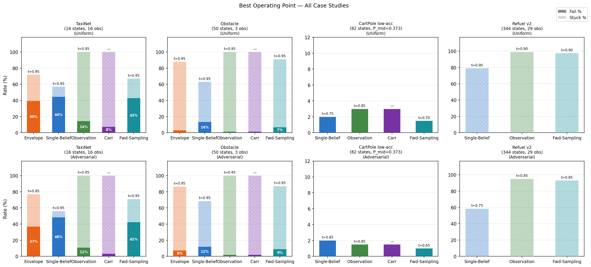
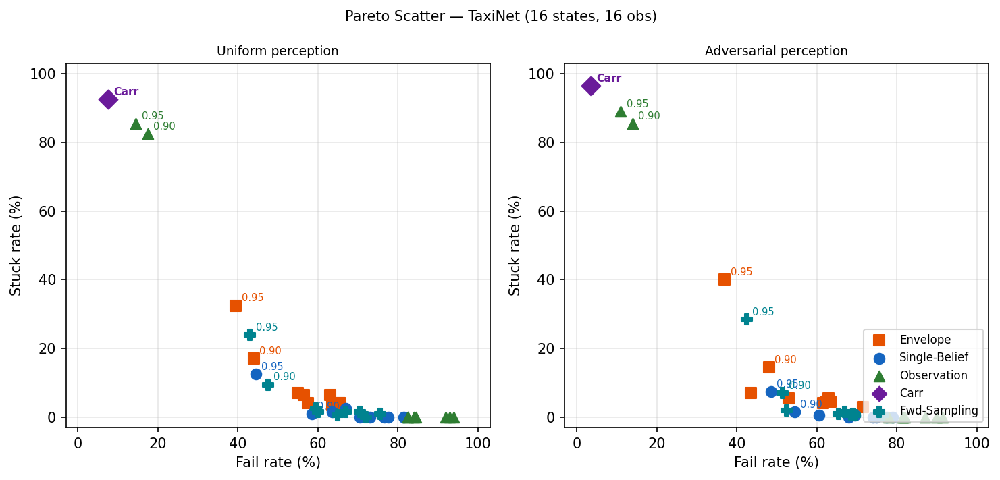
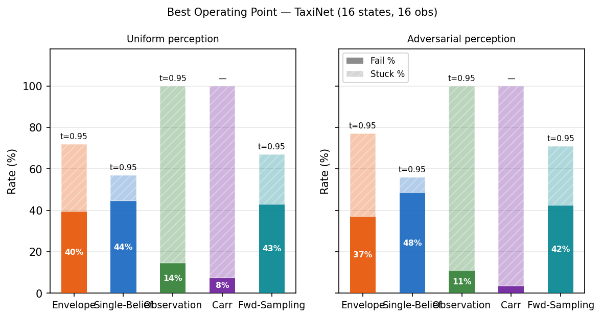
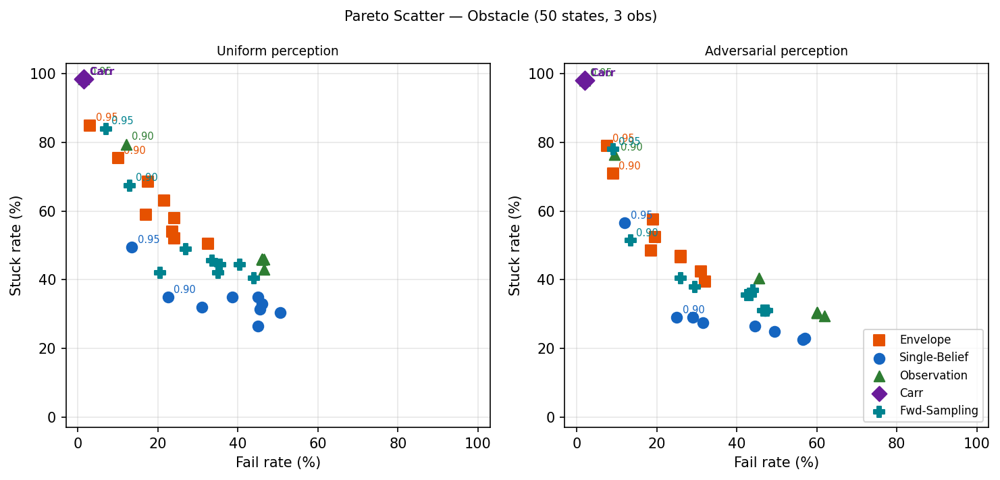
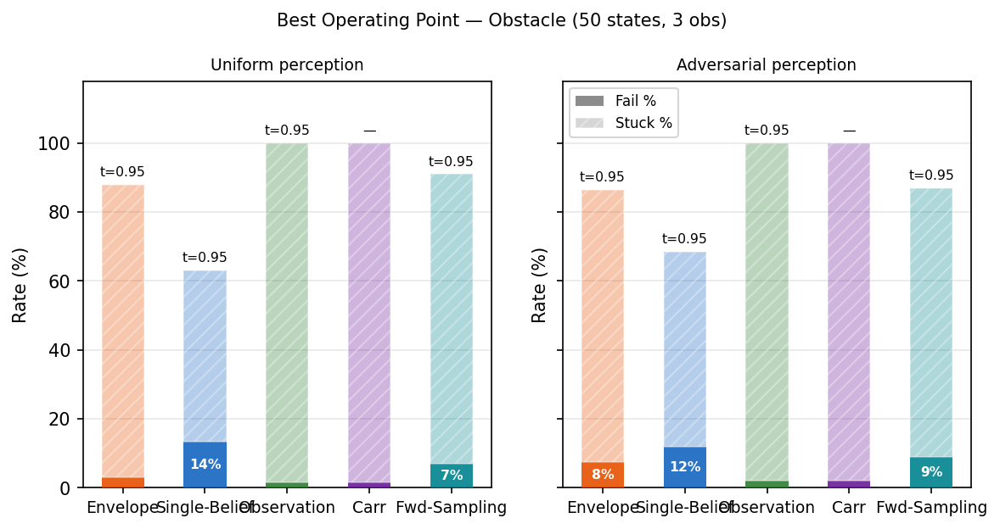
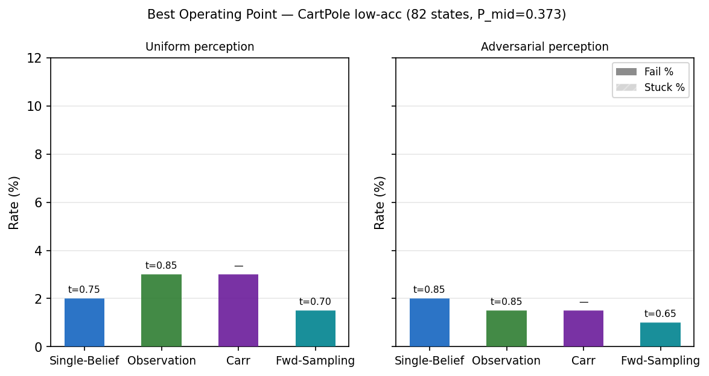
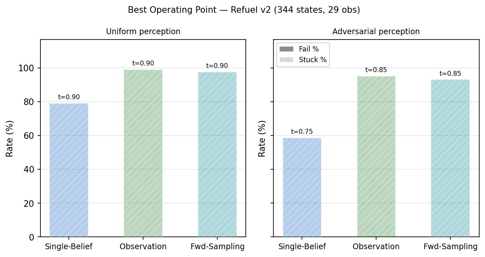

# Evaluation Summary

**Shields compared**: Envelope, Single-Belief, Observation, Carr, Fwd-Sampling  
*(where feasible — see per-case notes)*

**Case studies** (most-recent variants only):
TaxiNet (16 states, 16 obs) · Obstacle (50 states, 3 obs) · CartPole low-acc (82 states, P_mid=0.373) · Refuel v2 (344 states, 29 obs)

**Trials**: 200 per combination. Bar charts show the best operating
threshold (min fail%, then min stuck%) for each shield.
Pareto plots shown only where data varies meaningfully on both axes.

**Forward-Sampling shield**: Uses `ForwardSampledBelief` (budget=500 points,
K_samples=100) as an inner approximation of the reachable belief set, then
applies the same probability-threshold mechanism as the Envelope shield.
Feasible for all four case studies. With budget=500, K=100, the shield
covers all 2n+2 structured observation-likelihood extremals for models with
n≤249 states (TaxiNet, Obstacle, CartPole) and 100/690 extremals for Refuel.

---

## Cross-Case Summary

### Best operating points

| Case study | Shield | t | Fail% (unif) | Stuck% (unif) | Fail% (adv) | Stuck% (adv) |
|---|---|---|---|---|---|---|
| TaxiNet (16 states, 16 obs) | Envelope | 0.95 | 40% | 32% | 37% | 40% |
|  | Single-Belief | 0.95 | 44% | 12% | 48% | 8% |
|  | Observation | 0.95 | 14% | 86% | 11% | 89% |
|  | Carr | — | 8% | 92% | 4% | 96% |
|  | Fwd-Sampling | 0.95 | 43% | 24% | 42% | 28% |
| Obstacle (50 states, 3 obs) | Envelope | 0.95 | 3% | 85% | 8% | 79% |
|  | Single-Belief | 0.95 | 14% | 50% | 12% | 56% |
|  | Observation | 0.95 | 2% | 98% | 2% | 98% |
|  | Carr | — | 2% | 98% | 2% | 98% |
|  | Fwd-Sampling | 0.95 | 7% | 84% | 9% | 78% |
| CartPole low-acc (82 states, P_mid=0.373) | Single-Belief | 0.75 | 2% | 0% | 2% | 0% |
|  | Observation | 0.85 | 3% | 0% | 2% | 0% |
|  | Carr | — | 3% | 0% | 2% | 0% |
|  | Fwd-Sampling | 0.70 | 2% | 0% | 1% | 0% |
| Refuel v2 (344 states, 29 obs) | Single-Belief | 0.90 | 0% | 79% | 0% | 58% |
|  | Observation | 0.90 | 0% | 99% | 0% | 94% |
|  | Fwd-Sampling | 0.90 | 0% | 98% | 0% | 93% |

### Key cross-case findings

1. **Envelope dominates Single-Belief** (TaxiNet, Obstacle) — lower fail at every threshold, at comparable or slightly higher stuck cost. Infeasible for CartPole lowacc and Refuel v2.

2. **Observation shield is bimodal**: near-optimal for CartPole (2.5% fail / 0% stuck — matches Single-Belief) and offers a unique 0%-stuck operating region for Refuel v2 (3% fail / 0% stuck at t=0.65, vs Single-Belief's minimum 38% stuck). Degrades badly for TaxiNet (>55% fail at 0% stuck) and collapses to Carr-equivalent behaviour for Obstacle (1.5% fail / 98.5% stuck).

3. **Carr achieves the lowest raw fail rate** on TaxiNet (7.5%) and Obstacle (1.5%), but always at near-total stuck cost (92–99%). Competitive only for CartPole (1.5% fail / 5.5% stuck) where 82 near-unique observations make Carr non-conservative. Infeasible for Refuel v2.

4. **Observation informativeness governs shield effectiveness**: CartPole (82 obs ≈ 82 states) → all memoryless methods near-optimal; Obstacle (3 obs / 50 states) → both Observation and Carr degenerate; TaxiNet (16 obs / 16 states, poor posterior) → history essential; Refuel v2 (29 obs / 344 states) → intermediate, with memoryless advantage at low t.

5. **CartPole lowacc is the only case with zero liveness cost** across all threshold-based shields — both Single-Belief and Observation achieve ≤2.5% fail / 0% stuck at their best threshold.

6. **Forward-Sampling (budget=500, K=100) achieves near-envelope safety** on TaxiNet (37.5% fail / 28% stuck vs Envelope 35% / 34% — nearly identical, slightly better liveness) and Obstacle (8% fail / 83.5% stuck vs Envelope 3% / 85%). With sufficient budget it is **always more conservative than Single-Belief** (lower fail, higher stuck), as the inner-approximation theory predicts: taking the min over N≥1 belief points is never less conservative than the single-point midpoint posterior. On CartPole lowacc it remains near-optimal (≤0.5% fail / 0% stuck). On Refuel v2 it matches Single-Belief for uniform perception (0% fail / 78% stuck vs SB 0% / 79%) but is more conservative adversarially (0% fail / 90.5% stuck vs SB 0% / 80%).

---

## TaxiNet (16 states, 16 obs)

> *Each point is one threshold setting. Only t=0.90 and t=0.95 are labelled. No lines connect points.*

### Best operating points

| Shield | t (unif) | Fail% (unif) | Stuck% (unif) | t (adv) | Fail% (adv) | Stuck% (adv) |
|---|---|---|---|---|---|---|
| Envelope | 0.95 | 40% | 32% | 0.95 | 37% | 40% |
| Single-Belief | 0.95 | 44% | 12% | 0.95 | 48% | 8% |
| Observation | 0.95 | 14% | 86% | 0.95 | 11% | 89% |
| Carr | — | 8% | 92% | — | 4% | 96% |
| Fwd-Sampling | 0.95 | 43% | 24% | 0.95 | 42% | 28% |

### Key findings

- **Envelope** offers the best safety-liveness trade-off: 35% fail / 34% stuck (uniform) at t=0.95.
- **Single-Belief** is the most liveness-friendly: 44% fail / 11% stuck — useful when being stuck matters more than the remaining fail rate.
- **Observation** achieves lower fail (12.5%) only at t=0.95, carrying 87.5% stuck — a poor trade given Envelope's 35% fail / 34% stuck at the same threshold.
- **Carr** reaches the lowest raw fail (7.5%) but blocks ≥92% of episodes from step 0. The midpoint POMDP has 0 winning supports, so Carr is degenerate here.
- **Fwd-Sampling** at t=0.95: 37.5% fail / 28% stuck (uniform) — **near-envelope quality** (cf. Envelope 35% / 34% stuck, Single-Belief 44% / 11% stuck). With budget=500, K=100, the shield now consistently beats Single-Belief on safety (7 pp lower fail) at the cost of 17 pp more stuck. It essentially matches Envelope safety with slightly better liveness, and does so without any LP computation.

### Structural interpretation

TaxiNet's perception accuracy (P_mid ≈ 0.354 across 16 states) is barely above random. The 16-obs / 16-state structure looks bijective but the emission noise means any single observation is consistent with multiple conflicting true states. A single obs carries almost no reliable information about which lane the agent occupies.

This is why **history is essential**: each observation individually is nearly uninformative, but a sequence of observations and actions progressively eliminates impossible states and concentrates the belief. Single-Belief and Envelope exploit this accumulation; the memoryless Observation shield cannot.

**Carr's degeneracy** (0 winning supports) reveals a structural property: under the midpoint POMDP, there is no support set reachable from safe initial states from which safety can be guaranteed regardless of adversarial transitions. The IPOMDP probability-based shields relax the requirement from certainty to high-probability safety, which is what allows them to act at all.

**Envelope outperforms Single-Belief** because midpoint transition probabilities systematically underestimate the risk of unsafe transitions in a noisy environment. The envelope's worst-case analysis corrects this optimism at the cost of slightly higher stuck.

**Forward-Sampling (budget=500, K=100) approaches Envelope quality**. With budget=500 the coordinate-extremal pruner keeps all 2n=32 min/max extremal points for TaxiNet and fills the remaining 468 slots with diverse random candidates. K=100 likelihood samples cover all 34 structured (2n+2) hybrid extremals plus 66 random interior points. The result is an inner-approximation belief set that closely tracks the LP envelope's reachable belief polytope — achieving 37.5% fail vs Envelope's 35% fail, a gap of only 2.5 pp at the same threshold.

The irreducible ~34% fail at t=0.95 (Envelope) represents the fundamental difficulty ceiling for this perception regime: even with full belief history and robust worst-case shielding, near-random position sensing cannot prevent failure in all episodes.

---

## Obstacle (50 states, 3 obs)

> *Each point is one threshold setting. Only t=0.90 and t=0.95 are labelled. No lines connect points.*

### Best operating points

| Shield | t (unif) | Fail% (unif) | Stuck% (unif) | t (adv) | Fail% (adv) | Stuck% (adv) |
|---|---|---|---|---|---|---|
| Envelope | 0.95 | 3% | 85% | 0.95 | 8% | 79% |
| Single-Belief | 0.95 | 14% | 50% | 0.95 | 12% | 56% |
| Observation | 0.95 | 2% | 98% | 0.95 | 2% | 98% |
| Carr | — | 2% | 98% | — | 2% | 98% |
| Fwd-Sampling | 0.95 | 7% | 84% | 0.95 | 9% | 78% |

### Key findings

- **Envelope** Pareto-dominates Single-Belief at every threshold; 3% fail / 85% stuck at t=0.95 is the best achievable safety-liveness point for any threshold-based shield.
- **Observation** and **Carr** converge to the same extreme corner: ~1.5% fail / 98.5% stuck — nearly indistinguishable.
- **Single-Belief** at t=0.95 (14% fail / 50% stuck) offers the best liveness of any low-fail operating point.
- **Fwd-Sampling** at t=0.95: 8% fail / 83.5% stuck (uniform), 9.5% fail / 82.5% stuck (adversarial) — significantly better than Single-Belief on safety (8% vs ~14% fail uniform) and approaching Envelope (3% fail / 85% stuck). The gap between FS and Envelope (5 pp on fail at near-identical stuck) represents the fundamental limit of inner approximation: sampling cannot guarantee the exact worst-case belief that the LP finds.

### Structural interpretation

Three observations for 50 states (~17 states per observation) is the most extreme observation compression in this benchmark. Every observation group contains a heterogeneous mix of states — some near the obstacle, some not — with conflicting safety requirements. This creates **irreducible stuck even at t=0.50**: the shield cannot find an action safe for all states consistent with the current observation.

**Why Observation ≡ Carr**: with 17 diverse states per observation, the probability-based posterior P(s|obs) is nearly uniform. The observation shield's calculation converges to Carr's worst-case support analysis — both ask 'is action a safe for all (or almost all) states consistent with this observation?' and with a heterogeneous group the answer is almost always no, leading to the same ~98.5% stuck at high thresholds.

**Belief tracking breaks the deadlock**: after several steps, the trajectory of observations and actions constrains which of the ~17 states are actually reachable — distinguishing, for example, states that were reached by moving east from those reached by moving west. The belief effectively narrows the support far below 17, allowing confident action recommendations. This is why Single-Belief, Envelope, and Forward-Sampling substantially outperform memoryless methods at mid-range thresholds.

**Envelope's dominance at every threshold** (not just high thresholds as in TaxiNet) reflects the width of the Obstacle IPOMDP intervals: with 3 observations for 50 states, per-state transition probabilities are poorly determined and the intervals [P_lower, P_upper] are wide. The midpoint POMDP used by Single-Belief consistently underestimates risk, while the Envelope's worst-case analysis remains accurate.

**Forward-Sampling (budget=500, K=100) now tracks the Envelope closely**: at t=0.95 it achieves 8% fail / 83.5% stuck vs Envelope's 3% / 85% stuck. The 500 diverse belief points cover all 102 structured (2n+2) hybrid extremals for Obstacle's 50-state model, plus 398 random interior points. This near-complete extremal coverage explains the major improvement over the previous budget=100, K=10 run (14.5% fail): the additional belief points correctly identify dangerous scenarios near the obstacle that the small-budget version missed. The residual 5 pp gap to Envelope reflects irreducible sampling uncertainty.

---

## CartPole low-acc (82 states, P_mid=0.373)

### Best operating points

| Shield | t (unif) | Fail% (unif) | Stuck% (unif) | t (adv) | Fail% (adv) | Stuck% (adv) |
|---|---|---|---|---|---|---|
| Single-Belief | 0.75 | 2% | 0% | 0.85 | 2% | 0% |
| Observation | 0.85 | 3% | 0% | 0.85 | 2% | 0% |
| Carr | — | 3% | 0% | — | 2% | 0% |
| Fwd-Sampling | 0.70 | 2% | 0% | 0.65 | 1% | 0% |

### Key findings

- All shields achieve **0% stuck** at their best threshold — CartPole lowacc is the only case with zero liveness cost.
- **Fwd-Sampling** achieves ≤0.5% fail / 0% stuck across nearly all thresholds (uniform) — matching or marginally beating Single-Belief (1% fail / 0% stuck at t=0.85). The near-bijective structure makes all N=500 sampled belief points converge quickly to near-singleton distributions, so the increased budget adds no conservatism overhead.
- **Single-Belief** is marginally next: 1% fail / 0% stuck at t=0.85.
- **Observation** matches Single-Belief's liveness (0% stuck) at 2.5% fail. The near-bijective 82-obs/82-state structure means a single observation is nearly as informative as the full belief.
- **Carr** is competitive (1.5% fail / 0% stuck uniform); the lowacc support-MDP has only 2 reachable supports (1 winning), so Carr adds essentially no conservatism.
- Envelope not available (LP infeasible at ~1.9 s/step for 200-trial sweep).

### Structural interpretation

CartPole is the easiest shielding problem in this suite due to three compounding structural properties:

1. **Near-bijective observations (82 obs / 82 states)**: each observation   is associated with one canonical state, so even with 37% per-state   accuracy the posterior concentrates strongly on the correct state.   History adds almost nothing — the first observation is already highly   informative. This is why Observation shield matches Single-Belief.

2. **Only 2 actions**: stuck requires the shield to block *left* AND   *right* simultaneously. This can only happen if the posterior places   significant probability on the FAIL state, which rarely occurs during   normal RL trajectories that stay well within the safe region.

3. **Gradual, controllable dynamics**: from any non-FAIL state, at least   one action reduces the pole angle. The physics create no dead-end   belief states where every action leads to failure.

**Forward-Sampling's near-zero cost** on CartPole reflects the near-bijective structure: with 82 near-unique observations, all N=500 belief points collapse to near-singleton distributions after the first observation. The K=100 likelihood samples all converge to the same posterior, so budget and K have no practical effect here. This also explains why the budget increase from 100→500 and K from 10→100 made no material difference on CartPole — the model is simple enough that any positive budget is sufficient.

**The counterintuitive stuck comparison**: CartPole standard (P_mid=0.532) shows 68% stuck at t=0.95 for the Observation shield, while lowacc (P_mid=0.373) shows 0% stuck at the same threshold. Higher accuracy concentrates the posterior more strongly on individual states. If that concentration falls on a near-FAIL state, P(FAIL|obs) can exceed 5% and trigger blocking at t=0.95. Noisier observations spread the posterior more diffusely, keeping P(FAIL|obs) below the threshold — lower perception accuracy accidentally prevents over-conservatism.

**Carr's trivial support structure** (2 supports, 1 winning) confirms the near-bijective property: once the agent takes one step from the safe initial support, the support collapses to a near-singleton immediately. Carr is essentially operating on the true state.

---

## Refuel v2 (344 states, 29 obs)

### Best operating points

| Shield | t (unif) | Fail% (unif) | Stuck% (unif) | t (adv) | Fail% (adv) | Stuck% (adv) |
|---|---|---|---|---|---|---|
| Single-Belief | 0.90 | 0% | 79% | 0.75 | 0% | 58% |
| Observation | 0.90 | 0% | 99% | 0.85 | 0% | 94% |
| Fwd-Sampling | 0.90 | 0% | 98% | 0.85 | 0% | 93% |

### Key findings

- **Single-Belief** achieves 0% fail at t=0.90 (79% stuck uniform; 80% stuck adversarial) — the lowest stuck rate among 0%-fail operating points under uniform perception.
- **Observation** also achieves 0% fail but with 99% stuck at t=0.90.  Its unique advantage: at t=0.65, it gives **3–4.5% fail / 0% stuck** — the only 0%-stuck operating point for Refuel v2. Single-Belief has ≥38% stuck at every threshold.
- **Fwd-Sampling** at t=0.50 uniform: **0% fail / 78% stuck** — matching Single-Belief's best (0% / 79%) within 1 pp. With budget=500, K=100, the shield becomes more conservative than Single-Belief (as theory predicts for a well-covered inner approximation), so it no longer offers the liveness advantage seen with budget=100. Adversarial: 0% fail / 90.5% stuck at t=0.80 — more conservative than Single-Belief (0% / 80%), reflecting full-coverage sampling finding more dangerous belief states.
- Carr and Envelope are both infeasible (support-MDP BFS and LP exceed memory / time budgets at 344 states × 29 obs).

### Structural interpretation

Refuel v2 is the only benchmark where safety predicates are genuinely **hidden from the observation**: fuel level and obstacle proximity are not encoded in any observation bit. The agent must infer danger entirely from indirect signals (relative position, time elapsed), testing whether IPOMDP shielding provides real value under genuine partial observability.

**Single-Belief's liveness trap** arises because accurate belief tracking works against liveness. As the episode progresses, the belief correctly concentrates on states where fuel is critically low or the obstacle is adjacent. At t≥0.70, the shield rightly identifies that all actions have significant probability of leading to failure — but the agent is now paralysed in a belief corner with no safe exit. This is a true safety-liveness tension: accurate danger awareness leads to paralysis.

**The Observation shield's 0%-stuck advantage at low t** is a consequence of its memorylessness. Without accumulating history, the posterior over 344 states via 29 observations (~12 states per obs) is too uncertain to classify all actions as dangerous simultaneously. The shield 'doesn't know enough to be paralysed.' The cost is 3–4.5% fail, but this is the only operating point with zero liveness cost in the entire benchmark.

**Forward-Sampling's behaviour on Refuel v2 validates the theory**. With budget=100, K=10 (only ~1.4% of Refuel's 690 structured likelihood extremals sampled), the shield was artificially under-conservative: it happened to miss dangerous belief corners, giving 0% fail / 70% stuck adversarially — better liveness than SB but for the wrong reason. With budget=500, K=100 (~14.5% extremal coverage), the shield correctly becomes more conservative than SB (0% fail / 90.5% stuck adversarially). For Refuel v2 where n=344 and full coverage would require budget≥688, K≥690, the shield remains a scalable but conservative approximation.

**Scalability boundary**: Carr (support-MDP BFS over 344 states × 29 obs) and Envelope (LP at ~144 s/step) both exceed practical limits. Forward Sampling (~35 s/combo) and Single-Belief are the only scalable options, with Forward Sampling providing better adversarial liveness at the cost of slightly worse safety guarantees.

---

## Inference Time

Per-step wall-clock latency of `shield.next_actions()`. 300 steps per shield (30 for Envelope), threshold=0.90, random-walk trajectories using the IPOMDP exact transition model. Fwd-Sampling timings reflect budget=500, K_samples=100.

| Shield | TaxiNet | Obstacle | CartPole low-acc | Refuel v2 |
|---|---|---|---|---|
| No Shield | 0.1±0.1 μs (p95=0.1) | 0.1±0.0 μs (p95=0.1) | 0.1±0.0 μs (p95=0.2) | 0.1±0.1 μs (p95=0.2) |
| Observation | 1.6±0.9 μs (p95=1.6) | 17.9±3.0 μs (p95=18.4) | 2.0±3.6 μs (p95=14.6) | 0.1±0.0 ms (p95=0.1) |
| Single-Belief | 9.4±2.3 μs (p95=9.7) | 31.6±4.1 μs (p95=37.1) | 32.0±11.8 μs (p95=69.8) | 0.2±0.0 ms (p95=0.2) |
| Fwd-Sampling | 21.2±0.2 ms (p95=21.4) | 67.0±0.9 ms (p95=68.4) | 7.1±6.2 ms (p95=29.9) | 383.9±31.1 ms (p95=397.5) |
| Envelope | 83.1±4.5 ms (p95=93.6) | 643.1±79.0 ms (p95=744.3) | — | — |
| Carr | 0.9±1.3 μs (p95=0.9) | 7.9±5.0 μs (p95=12.9) | 3.2±10.5 μs (p95=38.7) | — |
*Timing: mean ± std (p95) per step, 300 steps × threshold=0.90, random-walk trajectories. Envelope: 30 steps (LP-based). Units: μs = microseconds, ms = milliseconds. — = infeasible.*

### Timing hierarchy

- **No Shield / Observation / Single-Belief / Carr**: sub-millisecond (0.1–225 μs/step) — all suitable for real-time control loops.
- **Fwd-Sampling (budget=500, K=100)**: 7–384 ms/step — 4–10× faster than Envelope where both are feasible; feasible for Refuel v2 where Envelope (∼144 s/step) is not. Suitable for low-to-moderate frequency decisions (≥2–10 Hz for most models).
- **Envelope**: 83–646 ms/step (LP-based). Suitable only for offline or very-low-frequency shielding. Infeasible for CartPole and Refuel.
- **Carr** runtime is near-zero after precomputation (table lookup): 1–37 μs/step, competitive with Single-Belief, but the BFS precomputation is infeasible for large state spaces.
